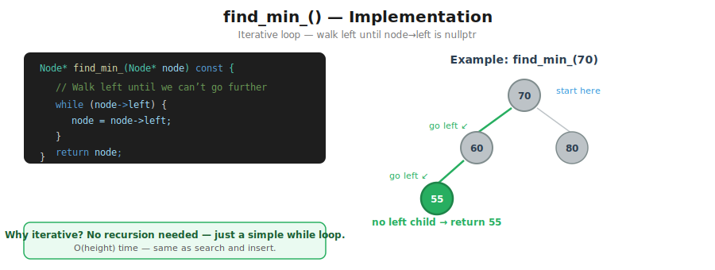
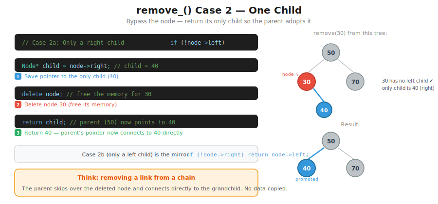
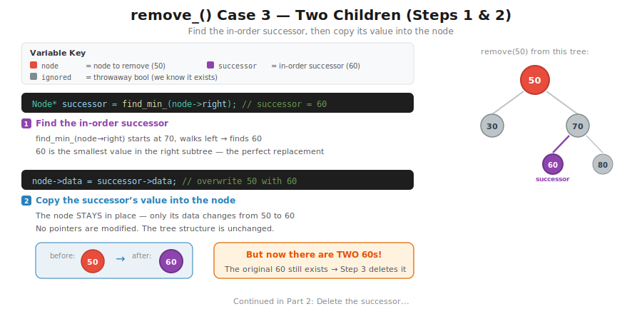
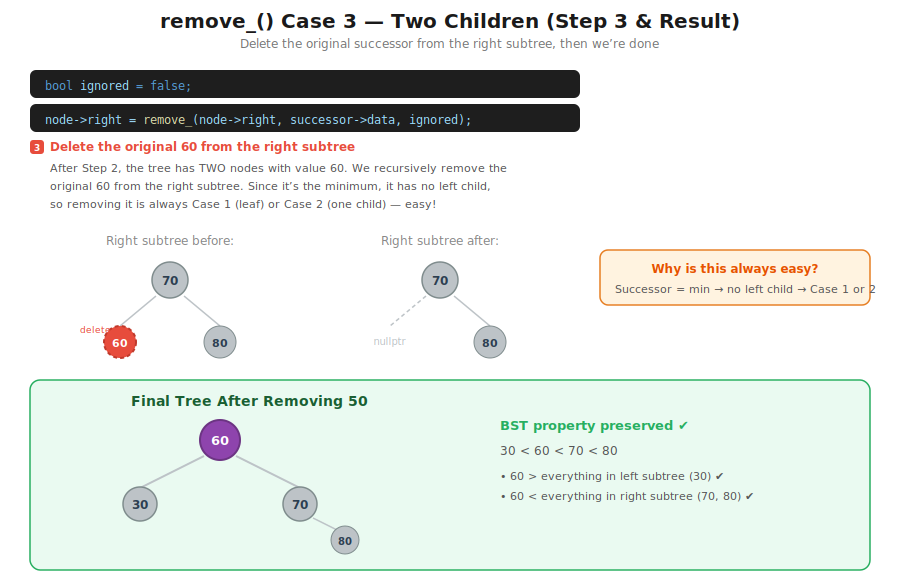

# CT16 -- Implementation Diagrams

Code-block diagrams referenced from `BinarySearchTree.cpp`.

---

## 1. find_min_() Implementation
*`BinarySearchTree.cpp::find_min_()` -- iterative loop walks left until no left child*

---

## 2. remove_() Case 1 -- Leaf Node
*`BinarySearchTree.cpp::remove_()` -- no children: delete node, return nullptr*

---

## 3. remove_() Case 2 -- One Child
*`BinarySearchTree.cpp::remove_()` -- bypass the node, return its only child*

---

## 4. remove_() Case 3 -- Two Children (Steps 1 & 2)
*`BinarySearchTree.cpp::remove_()` -- find the in-order successor, copy its value into the node*

---

## 5. remove_() Case 3 -- Two Children (Step 3 & Result)
*`BinarySearchTree.cpp::remove_()` -- delete the original successor, final tree*

