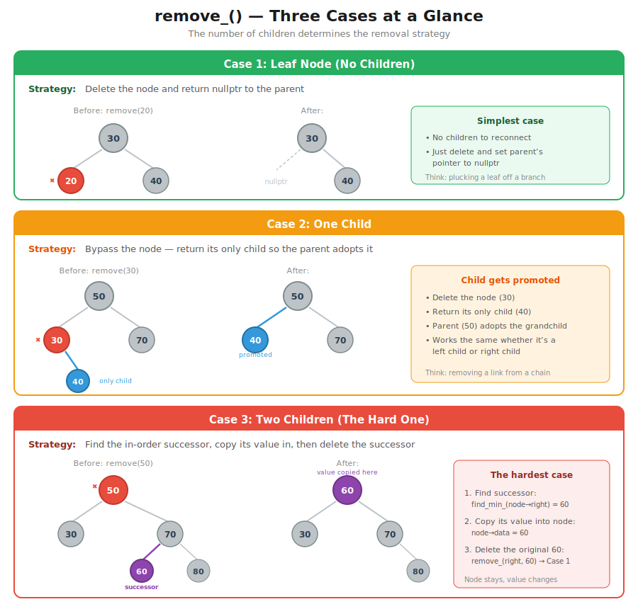

# CT15 -- Header Diagrams

Conceptual diagrams referenced from `BinarySearchTree.h`.

---

## 1. find_min_() Overview
*`BinarySearchTree.h::find_min_()` -- the minimum is always the leftmost node in a subtree*

---

## 2. remove_() -- Three Cases at a Glance
*`BinarySearchTree.h::remove()` -- leaf, one child, or two children determines the strategy*

